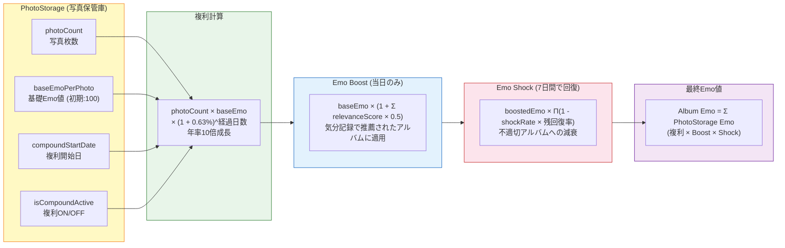
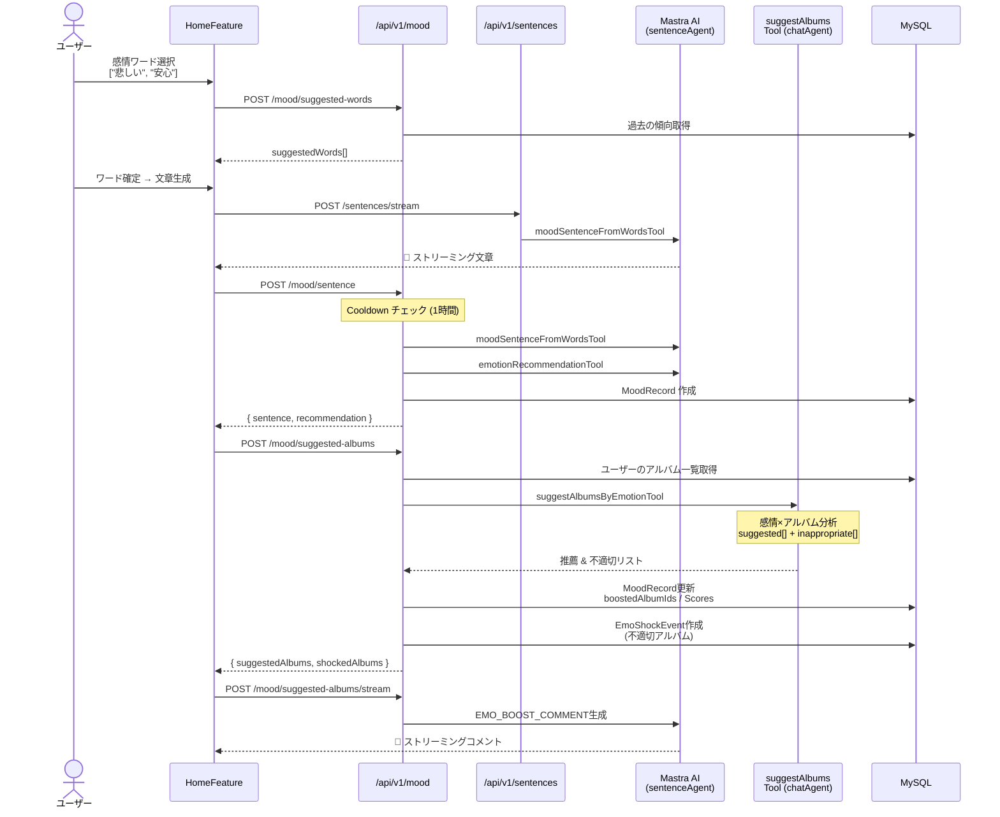
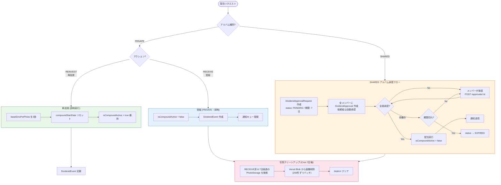
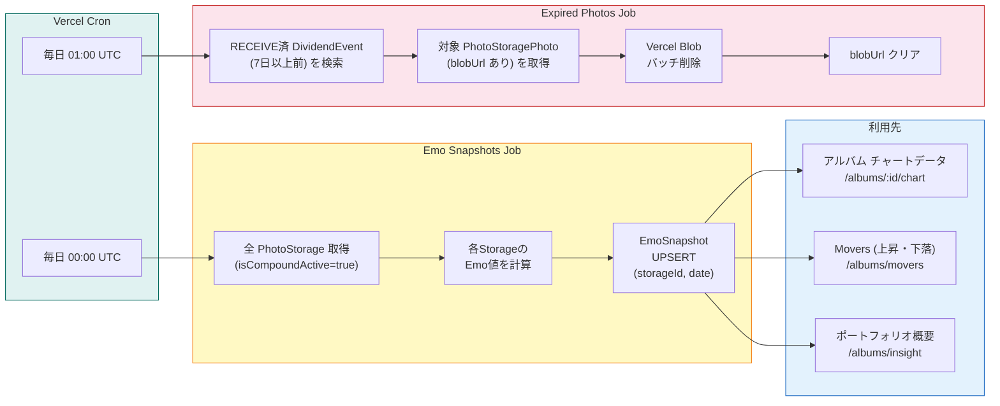
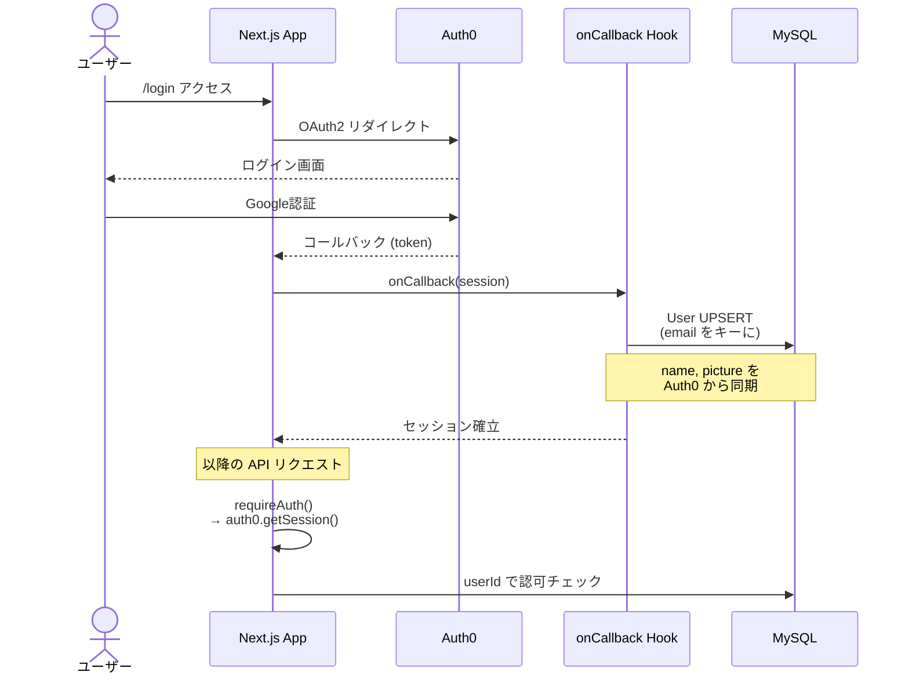
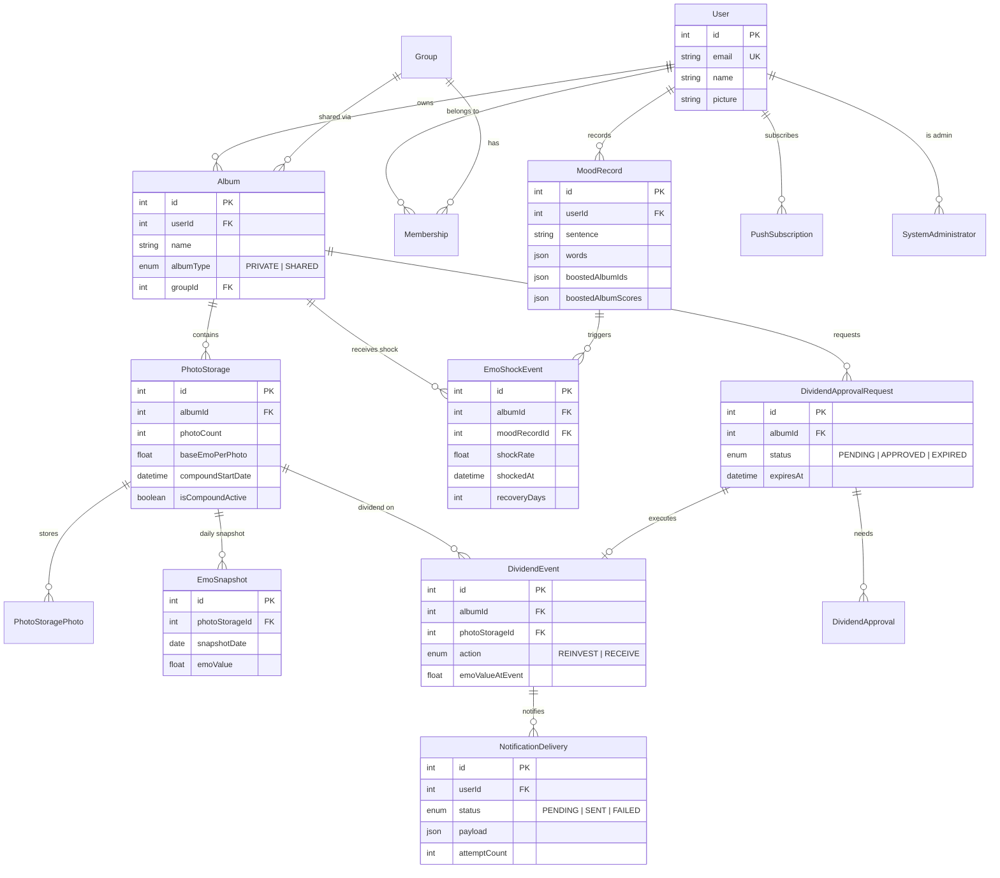
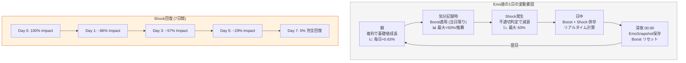

# Emodex: 「 EMOI × INDEX 」複利で増やすエモ投資 

## 1. システム全体アーキテクチャ

```mermaid
graph TB
    subgraph Client["Client Layer"]
        Browser["Browser / PWA"]
        SW["Service Worker<br/>push-sw.js"]
        Auth0SDK["Auth0 SDK<br/>useUser()"]
        AgentCtx["AgentComment<br/>Context + localStorage"]
    end

    subgraph AppRouter["Next.js App Router (app/)"]
        Pages["Pages<br/>/ /album /insight /invests<br/>/dividend /portfolio /admin"]
    end

    subgraph Features["Features Layer (features/)"]
        HomeF["HomeFeature<br/>気分入力 + Movers"]
        InvestF["InvestsFeature<br/>アルバム詳細"]
        InsightF["InsightFeature<br/>ポートフォリオ概要"]
        DividendF["DividendFeature<br/>配当一覧・詳細"]
        AdminF["AdminFeature<br/>管理者画面"]
        GraphF["GraphFeature<br/>チャート表示"]
    end

    subgraph Components["Components Layer (components/)"]
        MoodUI["UnifiedMoodForm<br/>EmotionTag / TagInput"]
        AlbumUI["AlbumMovers<br/>AlbumSelector / PhotoPicker"]
        ChartUI["ExponentialChart<br/>EmoChart"]
        DivUI["DividendList<br/>DividendDetail"]
        AuthUI["LoginButton<br/>LogoutButton / Profile"]
        LayoutUI["Header / Footer<br/>LayoutShell"]
    end

    subgraph API["API Routes (app/api/)"]
        direction LR
        APIMood["/api/v1/mood/*<br/>sentence / suggested-words<br/>suggested-albums / cooldown"]
        APIAlbum["/api/v1/albums/*<br/>CRUD / chart / insight<br/>movers / photo-storages"]
        APISentence["/api/v1/sentences/*<br/>generate / stream"]
        APIDividend["/api/v1/dividend/*<br/>execute / approvals"]
        APIGroup["/api/v1/groups/*<br/>CRUD / members"]
        APIChat["/api/chat/stream"]
        APIBlob["/api/blob/*<br/>upload / delete"]
        APIAdmin["/api/admin/*<br/>overview / emo"]
        APICron["/api/cron/*<br/>emo-snapshots<br/>expired-photos"]
    end

    subgraph BizLogic["Business Logic (lib/)"]
        AuthLib["auth0.ts<br/>Auth0Client / onCallback"]
        APIUtils["api-utils.ts<br/>requireAuth() / Zod"]
        EmoLib["emo-value.ts<br/>emo-boost.ts<br/>emo-shock.ts<br/>emo-snapshots.ts"]
        DivLib["dividend-execution.ts<br/>dividend-approval.ts<br/>dividend-notification.ts"]
        AlbumLib["albums.ts<br/>album-access.ts<br/>photo-storage.ts"]
        MoodLib["mood-scoring.ts<br/>mood-cooldown.ts"]
        NotifLib["server-notification.ts"]
    end

    subgraph Mastra["Mastra AI Layer (mastra/)"]
        ChatAgent["chatAgent<br/>OpenAI Codex"]
        SentenceAgent["sentenceAgent<br/>Claude Haiku 4.5"]
        WeatherAgent["weatherAgent<br/>GPT-4o"]
        Tools["Tools<br/>sentenceTool / moodTools<br/>suggestAlbumsTool<br/>weatherTool"]
        Workflows["weatherWorkflow<br/>fetch → plan"]
        Prompts["Prompts<br/>MOOD_SENTENCE<br/>SENTENCE_FROM_WORDS<br/>EMO_BOOST_COMMENT"]
    end

    subgraph DataLayer["Data Layer"]
        Prisma["Prisma 7<br/>@prisma/adapter-mariadb"]
        MySQL[("MySQL 8.4<br/>Docker :3307")]
    end

    subgraph External["External Services"]
        OpenAI["OpenAI<br/>GPT-5 Codex / GPT-4o"]
        Anthropic["Anthropic<br/>Claude Haiku 4.5"]
        Auth0Ext["Auth0<br/>OAuth2 / OIDC"]
        VBlob["Vercel Blob<br/>Image CDN"]
        OpenMeteo["Open-Meteo<br/>Weather API"]
        VCron["Vercel Cron<br/>Daily 00:00 / 01:00"]
        Turso["Turso / LibSQL<br/>Mastra Storage"]
    end

    Browser --> Pages
    SW -.- Browser
    Auth0SDK -.- Browser
    AgentCtx -.- Browser

    Pages --> HomeF & InvestF & InsightF & DividendF & AdminF & GraphF
    HomeF --> MoodUI & AlbumUI
    InvestF --> AlbumUI & ChartUI
    InsightF --> ChartUI
    DividendF --> DivUI
    GraphF --> ChartUI

    HomeF -- "fetch/stream" --> APIMood & APIAlbum & APISentence
    InvestF --> APIAlbum & APIBlob
    InsightF --> APIAlbum
    DividendF --> APIDividend
    AdminF --> APIAdmin

    APIMood --> MoodLib & EmoLib
    APIAlbum --> AlbumLib & EmoLib
    APIDividend --> DivLib & NotifLib
    APISentence --> Mastra
    APIChat --> ChatAgent
    APIBlob --> VBlob
    APICron --> EmoLib & AlbumLib

    APIMood --> Tools
    ChatAgent --> OpenAI
    SentenceAgent --> Anthropic
    WeatherAgent --> OpenAI
    Tools --> OpenMeteo

    EmoLib --> Prisma
    DivLib --> Prisma
    AlbumLib --> Prisma
    MoodLib --> Prisma
    Prisma --> MySQL

    AuthLib --> Auth0Ext
    VCron --> APICron

    style Client fill:#f5f5f5,stroke:#999
    style AppRouter fill:#e8f5e9,stroke:#2e7d32
    style Features fill:#e3f2fd,stroke:#1565c0
    style Components fill:#fff3e0,stroke:#e65100
    style API fill:#fce4ec,stroke:#c62828
    style BizLogic fill:#ede7f6,stroke:#4527a0
    style Mastra fill:#f3e5f5,stroke:#6a1b9a
    style DataLayer fill:#fff9c4,stroke:#f57f17
    style External fill:#e0f2f1,stroke:#00695c
```

## 2. コアドメインフロー: Emo値の計算と変動

## 3. 気分記録パイプライン (Mood Recording)

## 4. 配当フロー (Dividend)

## 5. 日次バッチ処理 (Cron Jobs)

## 6. 認証フロー (Auth0)

## 7. データモデル関連図

## 8. Emo値の時系列変動

